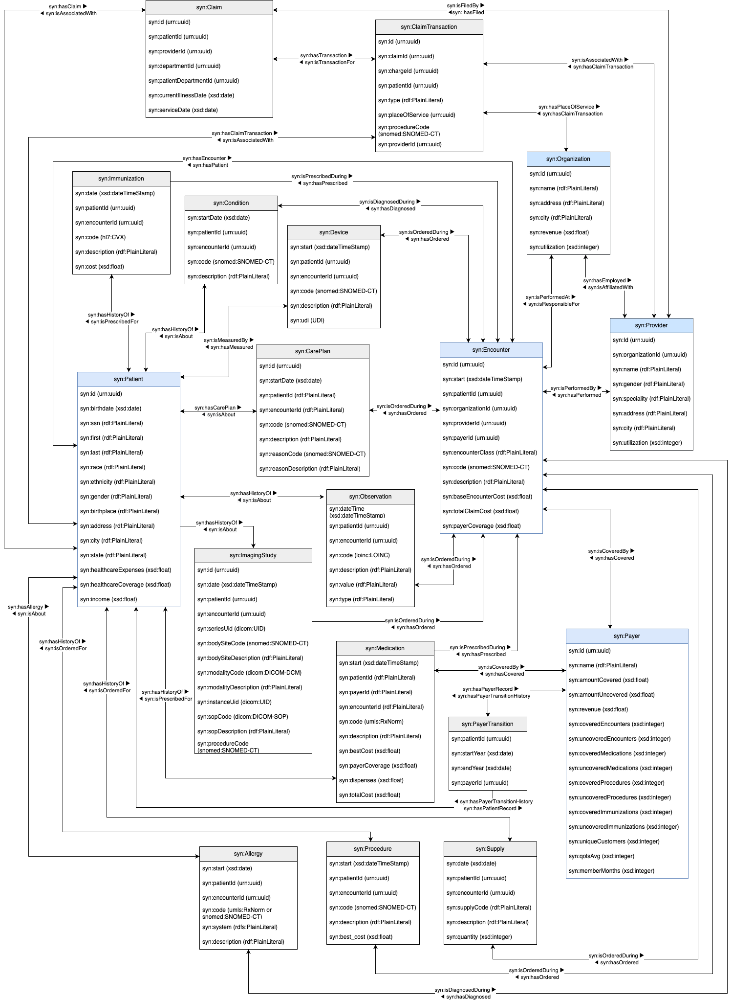
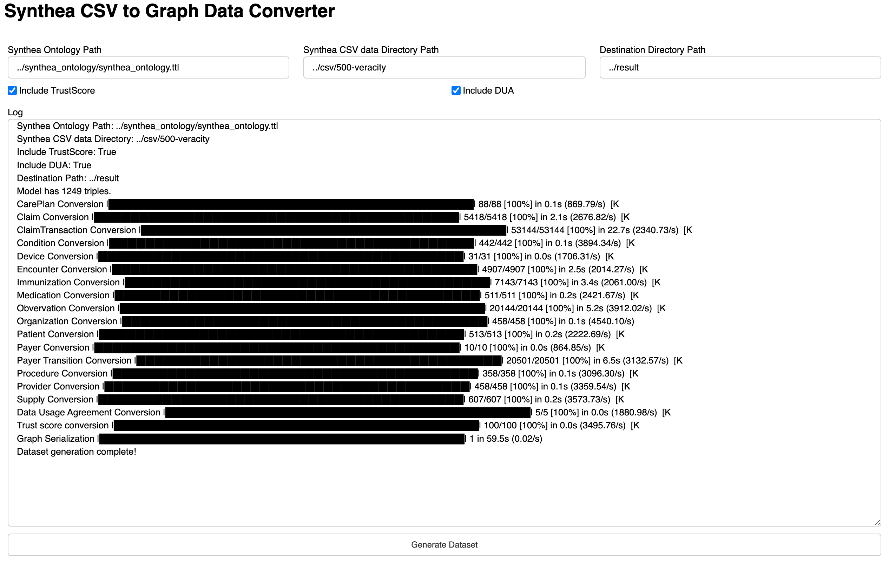
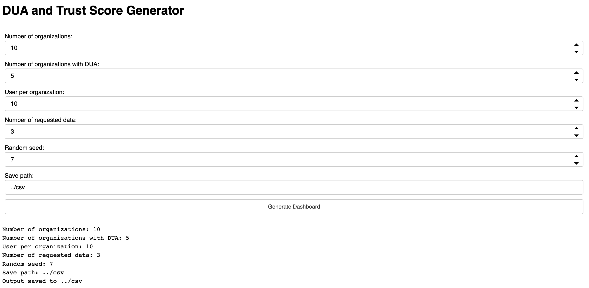

# 🕸️ SYNTHEA RDF
[](https://knacc.umbc.edu/) [](./LICENSE)

Semantic web representation for the [Synthea<sup>TM</sup>](https://github.com/synthetichealth/synthea) and CSVs to Turtle (.ttl) conversion tool.



## :hammer: Usage
### Installation
```bash
pip install synthea-rdf
```

### Graphical User Interface
There are user interfaces in the `gui` directory:
- [Synthea CSV to RDF converter](gui/synthea_converter.py)
- [Trust score and Data Usage Agreement (DUA) generator](gui/trustscore_dua_generator.py)

```bash
python3 synthea_converter.py
```


```bash
python3 trustscore_dua_generator.py
```

